# STM32UARTBootloader
STM32uart Bootloader Keil     
===================
[<i class=""></i>Tools Required](#tools-requried)
[<i class=""></i>Introduction](#Introduction)
[<i class=""></i>Memory Layout](#Memory-Layout)
[<i class=""></i>Steps for In Application Programming](#Steps-for-In-Application-Programming)
[<i class=""></i>References](#References)
#### <i class=""></i> Tools Required
-------------------
1. Keil uVision5 
2. USB to serial (2) 
3. STM32F407
4. Flash Loader Demonstrator(from stm)
5. Docklight or Hyperterminal or Putty.
#### <i class=""></i> Introduction
-------------------
A Bootloader for STM32F407 . Created using Keil Uvision5, UART protocol. BootLoader code and Blinky code(Application Code) are used. 
#### <i class=""></i> Memory Layout
-------------------
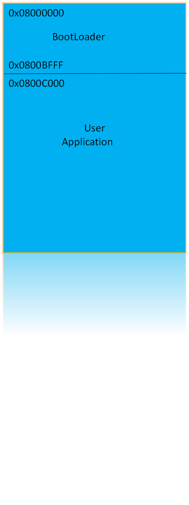
#### <i class=""></i> Steps for In Application Programming
-------------------
1. Flash the bootloader binary(BootLoader's Project.hex) in STM32F407 using keil and debugger(ulink, ST-Link,etc).
If debugger is not avaliable do the following steps.(remove debugger from the board otherwise following flashing maynot work)
- 1. connect USB to serial to PC side and connect PA9(TX from STM board side) PA10(RX from STM board side). If using prolific USB to serial connect white wire to PA9 and green wire to PA10.
- 2. Find the com port Name of USB to serial in the device manger in your PC.
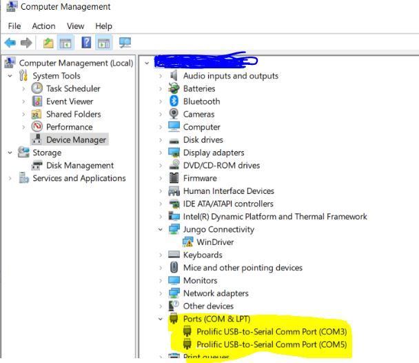
- 3. configure STM board in System memory boot mode by connecting BT0 - 3.3V BT1 -GND.(refer STM32F407 datasheet)
-	4. Open Flash Loader Demonstrator software choose the Port name obtained in step2.
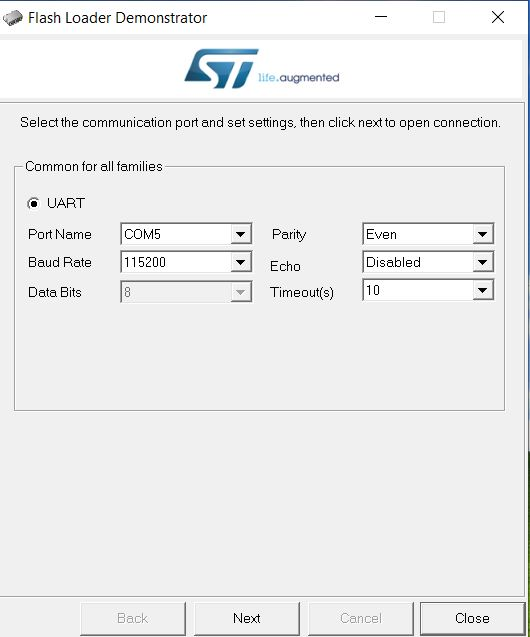
- 5. Click next ,next. reach the page where Erase ,Download to device, Upload from device options are available.
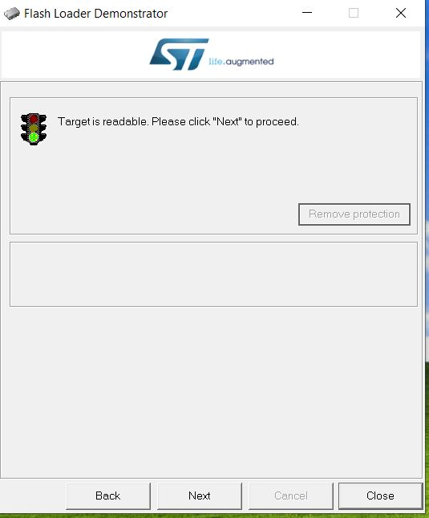
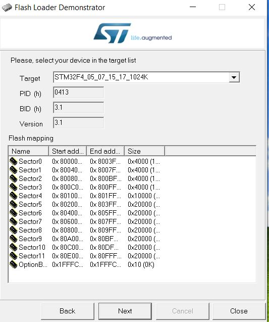
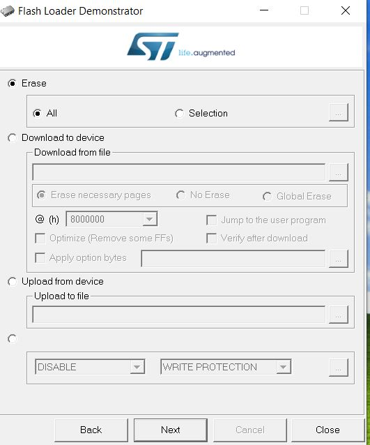
- 6. Choose Download to device option. Select necessary pages option. Choose  BootLoader's [BootLoader/Project/Output/Project.hex](BootLoader/Project/Output/Project.hex) file in Download from file (file select).
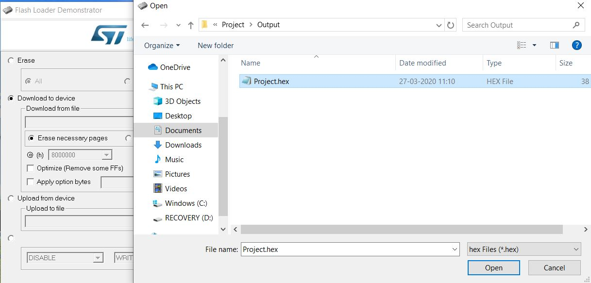
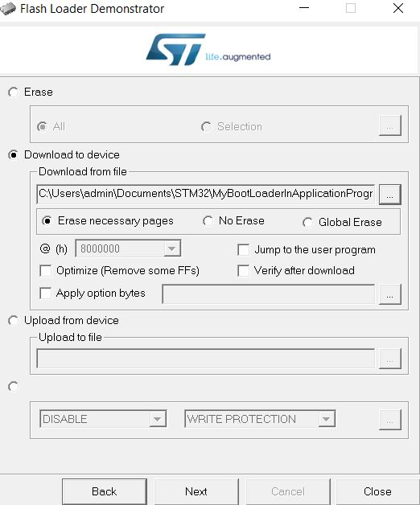
- 7. click next. code is flashed in the memory starting from memory location 0x08000000.
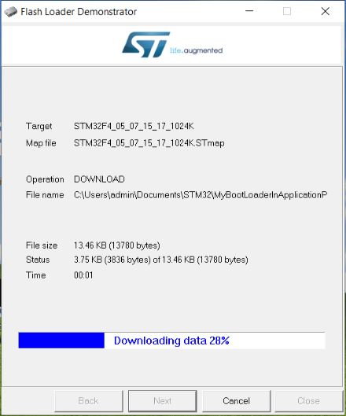
- 8. Configure STM board in Flash memory boot mode. This mode will be default boot mode as opposed to mode mention in step 3.
-	9. Now reset the board.
2. Connect the second USB to serial converter in pin PC10(Tx) PC11(RX).Find the comm port of this USB to serial Converter .Set the baud rate 115200 in the hyperterminal or Putty or Docklight.
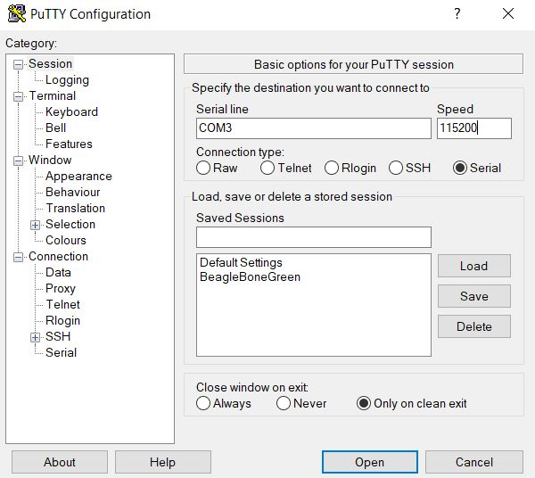
 - After reset will see the following message
```Welcome to STM32F407 Board.
	Press Y/y to Enter Boot Mode in 10 seconds
	9 Second Remaining
	8 Second Remaining
	7 Second Remaining
	6 Second Remaining
```
3. Before it reaches "0 Second Remaining" press 'Y' or 'y'.
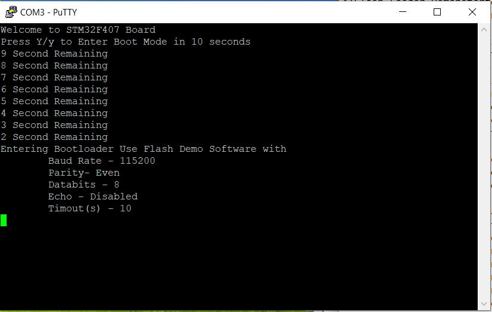
4. The following messages will appear
```
Entering Bootloader Use Flash Demo Software with
        Baud Rate - 115200
        Parity- Even
        Databits - 8
        Echo - Disabled
        Timout(s) - 10
```
5. Open Flash Loader Demonstrator software  Click next ,next .reach the page where Erase ,Download to device, Upload from device options are available. 
6. Choose Download to device option. Select necessary pages option. Choose [ApplicationCode/Project/Output/Project.hex](ApplicationCode/Project/Output/Project.hex) file in Download from file (file select).
- If custom application code need to flashed instead of Blinky. Do the following steps(only for keil uvision not for other IDE)
- 1. click Flash->configure Flash Tools.. in keil uvision a window will appear.
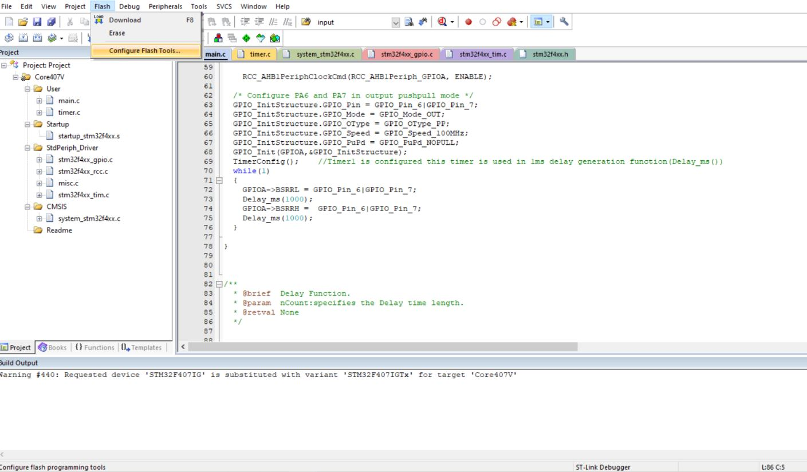
- 2. click Linker tab check if "Use Memory Layout From Target Dialogue" is selected. 
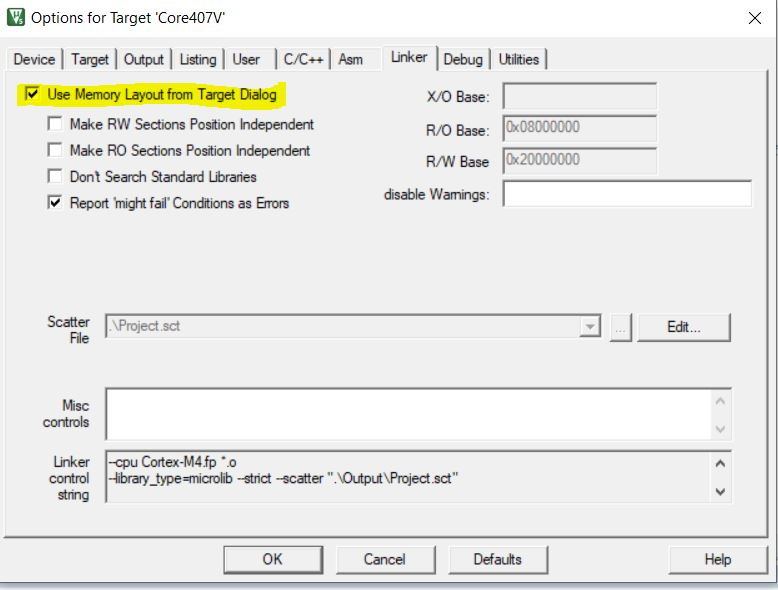
- 3. click Target tab select on-Chip IROM1 option  Change the start address for IROM1 to 0x0800C000.
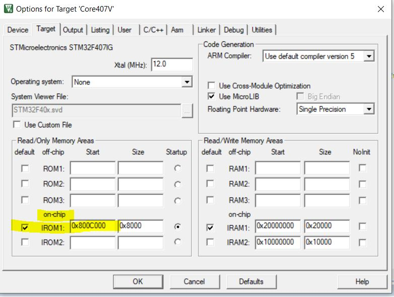
- 4. Re Build the code.
- 5. Choose the custom application's Project.hex file in Download from file (file select) in Flash Loader Demonstrator.
- 6. In Flash Loader Demonstrator in Download to Device make sure after selecting the hex file @(h) value will be 800C000. Select Jump to the user program.
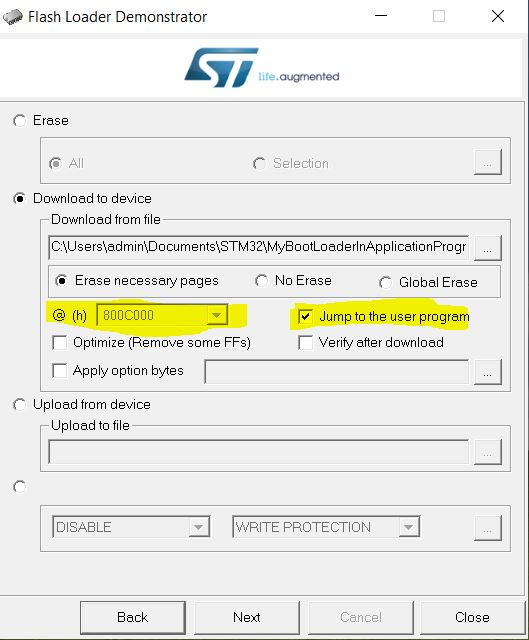
- 7. Click Next. Code will start flashing. will see debug message of code flashing in Hyperterminal.
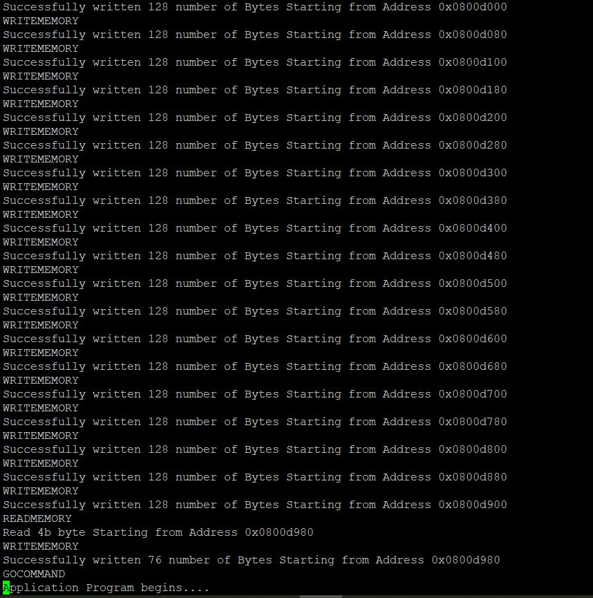
- 8. Application code will start executing from memory loaction 0x0800C000.
- 9. After flashing new Applicaiton if reset happens Application code will start executing after 10 seconds if 'Y' or 'y is not transmitted in debug port.
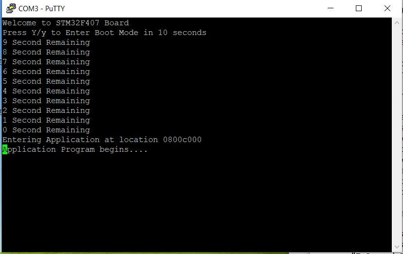
#### <i class=""></i> References
-------------------
1. UART bootloader for STM32 microcontroller github page stm32-bootloader [ferenc-nemeth](https://github.com/ferenc-nemeth/stm32-bootloader)
2. STM32F405xx STM32F407xx Device Data Sheet and Reference manual
3. AN2606 ST Application Note
4. AN5123 ST Application Note
5. AN3155 ST Application Note

